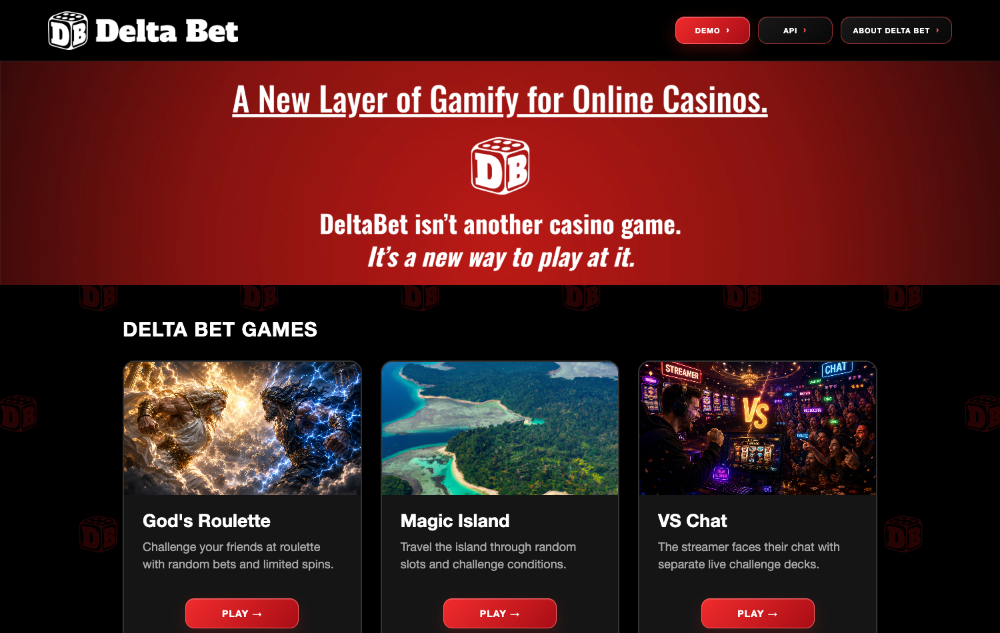
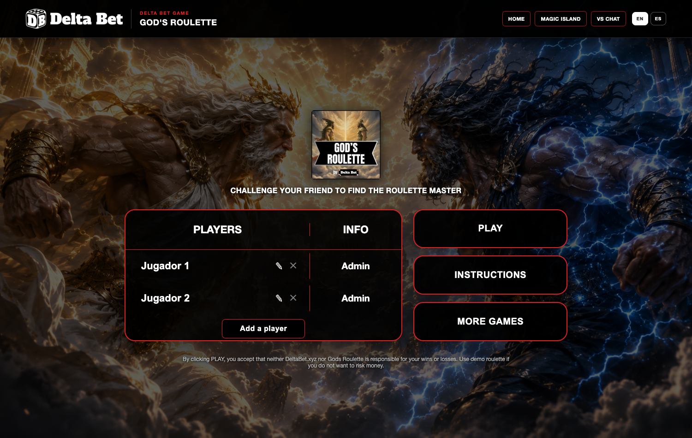

# DeltaBet - Social Gaming Layer for Online Casinos

DeltaBet is a B2B SaaS layer that adds **social, turn-based tournament mechanics on top of the games a casino already has** - without touching RTP, licenses or core infrastructure. Groups of friends compete in tournaments; each turn a player receives a challenge, completes it playing on the real casino, and performance is measured through account balance snapshots.

This repo contains the tournament engine, its REST API, and the playable game demos.

🌐 Product site: [deltabet.xyz](https://deltabet.xyz)





## Architecture

One tournament engine, N games as configurations on top:

```
server.js      Express API: matches, spins, balance snapshots, turn advancement
lib/
  engine.js    match engine: state machine, turns, scoring, public state projection
  roulette.js  roulette mechanics
public/        games hub + one playable demo per game
               (God's Roulette, Slots Challenges, VS Chat, Delta Pick, Keno,
                Bombs, Magic Island, Roulette Bingo, Road to Millionaire…)
```

## API surface

```
POST /api/matches               create a match
GET  /api/matches/:id           public match state
POST /api/matches/:id/spin      spin (turn action)
POST /api/matches/:id/balance   submit balance snapshot (casino integration point)
POST /api/matches/:id/advance   advance turn
```

The balance-snapshot endpoint is the key integration idea: the casino keeps full custody of money and games; DeltaBet only reads balance deltas to score challenges.

## Run

```bash
npm install
node server.js
```

Then open the games hub at `http://localhost:3000`.

> Note: business documentation (pricing, roadmap, game design catalogs) is kept private; this public repo covers the engine and demos.
